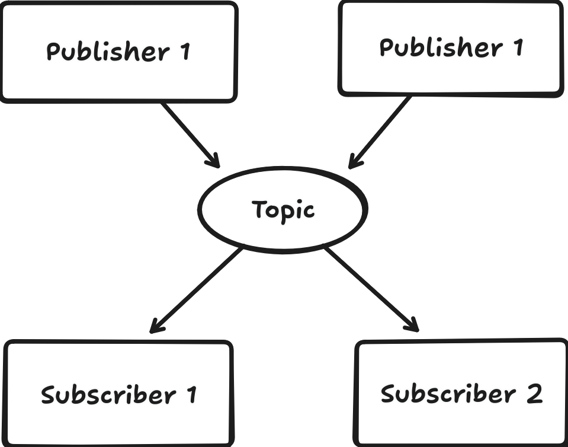
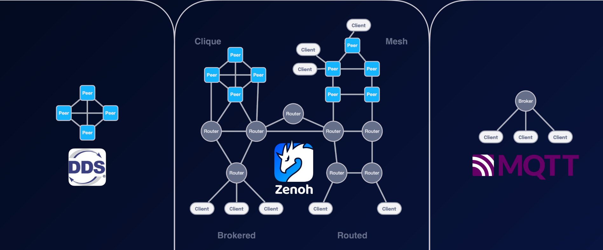

# 認識 Zenoh

> Zenoh Protocol 的吉祥物是一隻龍，還有每次的版本號也都是用龍相關的名字來命名的！

## 1. Pub/Sub 協議的重要性

在分散式系統中，元件需要交換資料。傳統的 **Request/Response** 雖然直觀，但在大規模或即時場景中，耦合度高、效率不足。

**Pub/Sub（發佈/訂閱）** 解決了這個問題：

* **Publisher**：只負責發佈訊息，不需知道誰接收。
* **Subscriber**：訂閱感興趣的主題，自動接收訊息。

優點：

* 低耦合
* 可擴展
* 即時性

### 基本 Pub/Sub 架構



---

## 2. Zenoh 的起源與背景

[Zenoh](https://github.com/eclipse-zenoh/zenoh) 是由 **ZettaScale** 於2019年開始研發,在Eclipse基金會底下孵育的一個開源項目，起源於 **可規模化的分散式跨網路跨平臺的資料流挑戰**，以解決之前在開發[Cyclone DDS](https://github.com/eclipse-cyclonedds/cyclonedds/) 時遇到的困難。

題外話，Zenoh當初研發時，Rust的Async語法甚至尚未穩定，好用的async runtime也尚未定奪，整個Zenoh的開發歷史算是伴隨著Rust Async的發展一起成長的。

---

## 3. Zenoh 對比其他常見的Pub/sub架構

### 功能比較


| 功能 / 協議   | DDS（資料分發服務） | MQTT（訊息佈告協定） | Kafka（分散式串流平台） | Zenoh                       |
| --------- | ----------- | ------------ | -------------- | --------------------------- |
| **架構**    | 點對點 (P2P)   | Broker 中心化   | Broker 叢集      | 路由網格 (Mesh) + P2P |
| **延遲**    | 低    | 中    | 高      | 低                  |
| **吞吐量**   | 高     | 低      | 中       | 高                    |
| **部署難易度** | 中等          | 簡單           | 中等           | 簡單 / 靈活                     |
| **拓撲彈性**  | P2P      | 集中式          | 叢集化            | 動態網格，跨網段                    |
| **輕量性**   | 中等          | 非常輕量         | 重量級            | 輕量且可擴展                      |
| **適用場景**  | 即時系統        | IoT、行動應用     | 大數據管線          | IoT、邊緣、雲端混合                 |

> Zenoh 結合 **低延遲、高吞吐量、靈活網格拓撲**，非常適合 **IoT、邊緣與雲端混合系統**，在多場景應用上超越 DDS、MQTT 與 Kafka。


### 部署拓撲比較

Zenoh在設計之初，就是爲了要能夠高效支援各種的網路拓撲，突破之前DDS的限制，做爲雲端與地端之間的橋樑，同時也考慮到能否大規模部署的效率。



---

## 4. 效能比較

根據這份[實驗報告](https://zenoh.io/blog/2023-03-21-zenoh-vs-mqtt-kafka-dds/)，Zenoh 的性能在各項指標上優於 DDS、MQTT 與 Kafka。


在吞吐量上全面優於其他的框架，甚至高過MQTT和Kafka一兩個數量級。


在延遲上比肩DDS也遠遠超越MQTT跟Kafka。


| Protocol         | Single-Machine Latency (µs) | Multi-Machine Latency (µs) |
|------------------|----------------------------|----------------------------|
| Zenoh-pico       | 5                          | 13                         |
| Zenoh P2P        | 10                         | 16                         |
| Zenoh brokered   | 21                         | 41                         |
| DDS (Cyclone)    | 8                          | 37                         |
| MQTT             | 27                         | 45                         |
| Kafka            | 73                         | 81                         |
| ping (baseline)  | 1                          | 7                          |


---

## 5. Rust 範例

關於Rust相關的細節，請容筆者在後續的文章中陸續揭曉。在此先讓我們用以下簡單的pub/sub範例來劃下今天的句點吧！


### Subscriber


```rust
use zenoh::prelude::*;

#[tokio::main]
async fn main() {
    zenoh::init_log_from_env_or("error");

    let (config, key_expr) = parse_args();
    let session = zenoh::open(config).await.unwrap();

    let subscriber = session.declare_subscriber(&key_expr).await.unwrap();
    println!("Subscribed on '{key_expr}'...");

    while let Ok(sample) = subscriber.recv_async().await {
        let payload = sample.payload().try_to_string().unwrap_or_default();
        println!("Received: {} = {}", sample.key_expr(), payload);
    }
}
```

### Publisher

```rust
use zenoh::prelude::*;
use std::time::Duration;

#[tokio::main]
async fn main() {
    zenoh::init_log_from_env_or("error");

    let (config, key_expr, payload) = parse_args();
    let session = zenoh::open(config).await.unwrap();

    let publisher = session.declare_publisher(&key_expr).await.unwrap();
    println!("Publishing on '{key_expr}'...");

    for idx in 0..u32::MAX {
        tokio::time::sleep(Duration::from_secs(1)).await;
        let buf = format!("[{idx}] {payload}");
        publisher.put(buf).await.unwrap();
    }
}
```

---

## 6. 總結

Zenoh 將 **DDS 的即時性、MQTT 的輕量性、Kafka 的高吞吐量** 完美結合。
對 Rust 開發者提供直觀且高效的 API，幫助快速構建端到端分散式資料系統。
